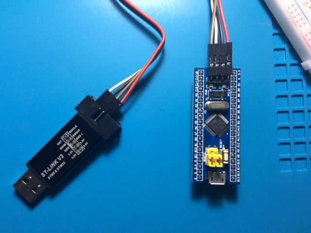

# stm32-blink

This is a simple blink example written in assembly for the Blue Pill board (`STM32F103C8T6`).

## Build

You'll need the `arm-none-eabi` toolchain installed. On Ubuntu:

    sudo apt install binutils-arm-none-eabi gcc-arm-none-eabi gdb-arm-none-eabi

To build the blink example:

    git clone https://github.com/moefh/stm32-blink.git
    cd stm32-blink
    make

This will create the file `blink.bin` in the `src` directory.

## Run

You'll need a [Blue Pill board](https://stm32-base.org/boards/STM32F103C8T6-Blue-Pill.html) and a [ST-Link programmer](https://stm32-base.org/boards/Debugger-STM32F101C8T6-STLINKV2).

The open source tool to upload programs to the board is `st-flash`. You can either
grab a release from https://github.com/stlink-org/stlink/releases/latest or compile
it yourself (there's a Ubuntu package `stlink-tools` which provides `st-flash`, but
the latest version is too old and doesn't seem to support the `STM32F103C8T6`).

If you choose to compile it yourself, the steps for Ubuntu are:

    sudo apt install cmake libusb-1.0-0-dev
    git clone https://github.com/stlink-org/stlink
    cd stlink
    make
    sudo cp build/Release/bin/st-* /usr/local/bin

After you have `st-flash` installed, upload the blink program to the board with:

    sudo st-flash --reset write src/blink.bin 0x8000000
